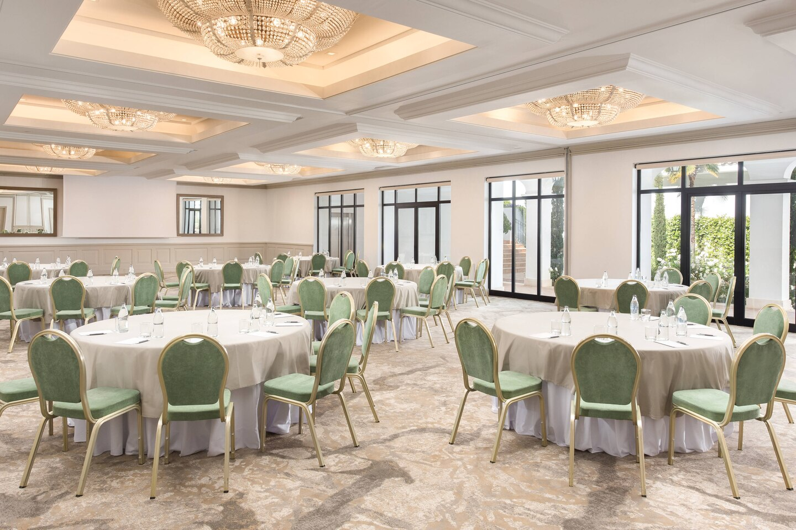
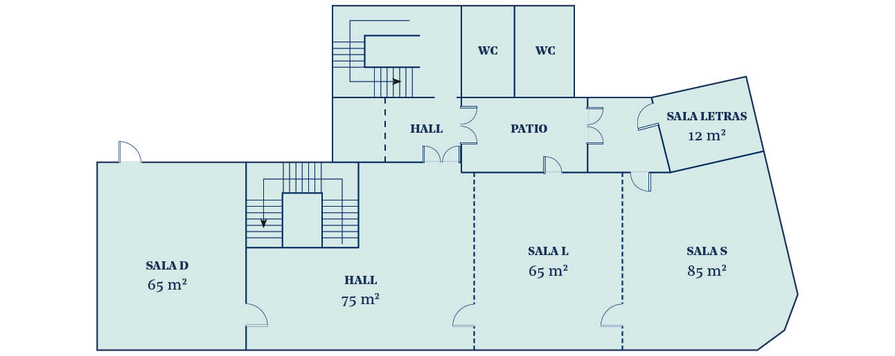
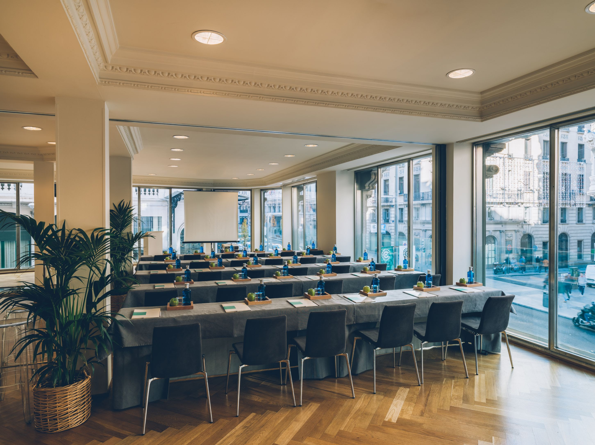
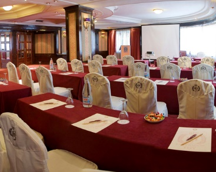

<style>
.list-group-item.active, .list-group-item.active:focus, .list-group-item.active:hover {
    background-color: #EA5933;
}
</style>

<style>
.nav>li>a {
    position: relative;
    display: block;
    padding: 10px 15px;
    color: #EA5933;
    font-weight: bold;
}
.nav-pills>li.active>a, .nav-pills>li.active>a:hover, .nav-pills>li.active>a:focus {
    color: white;
    background-color: #EA5933;
}
</style>

<style>

.precio{
background-color:#828282;
color: white;
padding: 10px;
border: 1px solid black;
margin-left: 5px;
border-radius: 5px;
}
</style>

<br>


<script> 
    $(document).ready(function() { 
    $head = $('#header'); 
    $head.prepend('<A href = https://www.cuttingedge-events.com></A>') 
    }); 
</script> 


```{r echo=FALSE, message=FALSE,warning=FALSE}
library(readxl)
library(dplyr)
library(knitr)
```

# SUGGESTED DESTINATIONS

**Programme**

<iframe src="timeline.html" frameborder="0" width="100%" height="1000" scrolling="no"></iframe>

## **MALAGA- MARBELLA**


### Map

<iframe src="https://www.google.com/maps/d/embed?mid=1hF9MGJ7JXxc8xKSBUG5uXyIGAGS57rX-&hl=es" width="100%" height="480"></iframe>

</br>


### Hotel Options {.tabset .tabset-fade .tabset-pills}

#### Westin La Quinta

<iframe src="LaQuinta/LaQuinta.html" frameborder="0" width="100%" height="1400" scrolling="yes"></iframe>

</br>

**Meeting Facilities**

The plenary room that Oticon would use is Guadaiza room, 

</iframe>

</iframe>

</br>

<iframe width="100%" height="500" src="https://www.youtube.com/embed/FeoOCKPUXwE" frameborder="0" allow="accelerometer; autoplay; encrypted-media; gyroscope; picture-in-picture" allowfullscreen></iframe>

</br>

#### Hilton el Higueron

<iframe src="Hilton El Higueron/ElHigueron.html" frameborder="0" width="100%" height="1500" scrolling="no"></iframe>

**Plenary room**

The name of the rooms is Tapies and it has capacity for 50 pax in cabaret style

</iframe>


</br>

<iframe width="100%" height="500" src="https://www.youtube.com/embed/UWHgBiSqHwM" frameborder="0" allow="accelerometer; autoplay; encrypted-media; gyroscope; picture-in-picture" allowfullscreen></iframe>

</br>


### Restaurant Trocadero Arena

<iframe src="TrocaderoArena/TrocaderoArena.html" frameborder="0" width="100%" height="1250" scrolling="no"></iframe>

</br>


<div class="precio">
<p> Rates: 
  <ul>
  * Dinner menu including starters to share, main course, dessert, drinks (1 bottle of wine each 3 pax and water) and Coffee, from: 75€ VAT inc

   </ul>
</p>
</div>

</br>

### Budget {.tabset .tabset-fade .tabset-pills}

#### La Quinta

<iframe src="budgetlaquinta.html" frameborder="0" width="100%" height="1400" scrolling="no"></iframe>

</br>

#### El Higueron

<iframe src="budgetelhigueron.html" frameborder="0" width="100%" height="1000" scrolling="no"></iframe>

</br>

*****


## **MADRID**

### Map

<iframe src="https://www.google.com/maps/d/embed?mid=1S7Clv1LuqntoE9bzjqRAwCbQ8p7eCJpS&hl=es"  width="100%" height="480"></iframe>

</br>


### Hotel Options {.tabset .tabset-fade .tabset-pills}

#### Iberostar Las Letras

<iframe src="LasLetras/LasLetras.html" frameborder="0" width="100%" height="1500" scrolling="no"></iframe>

</br>

**Meeting Facilities**

The plenary room that Oticon would use is S+L

</iframe>

</iframe>

</br>


#### Hotel Emperador

<iframe src="Emperador/Emperador.html" frameborder="0" width="100%" height="1400" scrolling="no"></iframe>

</br>

Hotel Emperador's plenary meering room has natural light 

</iframe>

</br>

### Restaurant Café de Oriente

<iframe src="CafedeOriente/CafedeOriente.html" frameborder="0" width="100%" height="1250" scrolling="no"></iframe>


<div class="precio">
<p> Rates: 
  <ul>
  * Dinner menu including starters to share, main course, dessert, drinks (1 bottle of wine each 3 pax and water) and Coffee, from: 52€ VAT inc

   </ul>
</p>
</div>

</br>
</br>


### Other restaurant options {.tabset .tabset-fade .tabset-pills}

#### Sin Sombrero

<iframe src="SinSombrero/SinSombrero.html" frameborder="0" width="100%" height="1200" scrolling="no"></iframe>

</br>

<div class="precio">
<p> Rates: 
  <ul>
  * Dinner menu including starters to share, main course, dessert, drinks (unlimited until dessert) and Coffee, from: 62€ VAT inc

   </ul>
</p>
</div>


#### Serafina

<iframe src="Serafina/Serafina.html" frameborder="0" width="100%" height="1450" scrolling="no"></iframe>

</br>

<div class="precio">
<p> Rates: 
  <ul>
  * Dinner menu including starters to share, main course, dessert, drinks (1 bottle of wine each 3 pax and water) and Coffee, from: 48€ VAT inc

   </ul>
</p>
</div>

### Budget {.tabset .tabset-fade .tabset-pills}

#### Las Letras

<iframe src="budgetlasletras.html" frameborder="0" width="100%" height="1800" scrolling="no"></iframe>

</br>

#### Emperador

<iframe src="budgetemperador.html" frameborder="0" width="100%" height="1500" scrolling="no"></iframe>

</br>


# TERMS AND CONDITIONS

  * Rates valid for Oticon Seminar - March 2020
  
  * For a group of minimum 35 pax.
  
  * Cutting Edge Events management fee including in the detailed rates
  
  * VAT included. 
  
  * No reservation has been done. Availability upon request.
  
*****


